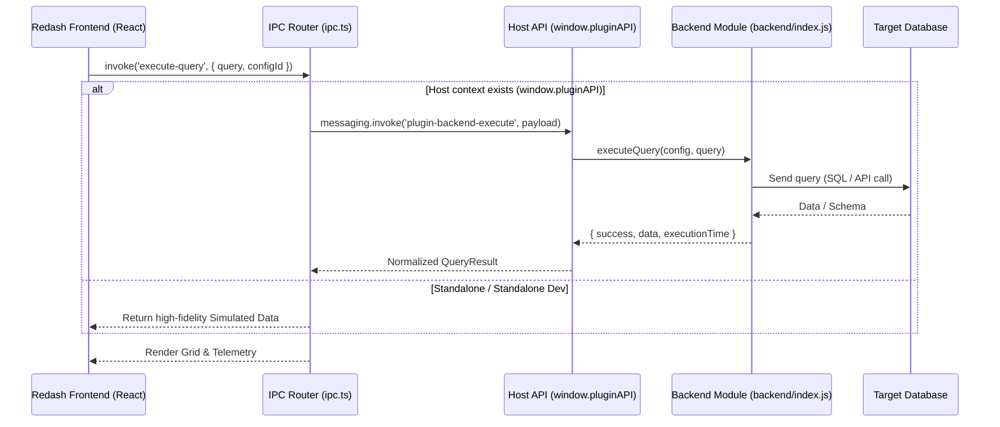

# 🚀 Redash Database Client Plugin

A premium, interactive database management and query client designed for modern workspaces. Redash supports standard SQL relational databases and NoSQL Document databases (MongoDB & friends). It can be executed either as an **integrated plugin** inside a host shell (like DevScribe) or in a **standalone mock environment** for local development.

---

## ✨ Features

### 1. Dual-Engine Visual Experience
Redash detects the database dialect and dynamically switches between two tailored user interfaces:
*   **SQL Query Engine (`DbQueryPage`)**: Engineered for relational database systems (PostgreSQL, MySQL, SQLite). Features multi-database selectors, an autocomplete-capable SQL editor, and responsive sidebars.
*   **Document DB Engine (`DocDbPage`)**: Engineered for document databases (MongoDB). Features a dedicated JavaScript query console (`DocDbEditor`), an interactive collections browser (`DocDbSidebar`), and rich JSON result visualizers.

### 2. Interactive ER Diagrams (`ErDiagram`)
*   **Topological Layout Sorting**: Automatically structures schema tables based on their relations (parent tables are sorted to the left/top; child tables cluster around them).
*   **Interactive SVG Edges**: Renders responsive SVG connectors that highlight dynamically when a column or table is hovered over.
*   **Schema Schema Inspector**: View primary keys, foreign key targets, and column data types at a glance.

### 3. Professional Query Editor
*   Powered by `@monaco-editor/react` for high-performance syntax highlighting, code autocompletion, bracket matching, and indentation.
*   Supports full-screen resizable panes with horizontal and vertical drag-splitters to balance editor space and results.

### 4. Rich Result Visualization
*   **Telemetry Panel**: Live tracking of query execution times (in ms) and serialized payload data sizes.
*   **Data Explorer**: High-density interactive tables with search, sorting, and pagination capabilities.
*   **Error Diagnostics**: Highlights server and database errors immediately.

### 5. Architectural Flexibility (Dual-Mode IPC)
*   **Production/Host Mode**: Hooks natively into `window.pluginAPI` to trigger desktop-level database drivers, file system states, and native window IPC channels.
*   **Standalone Mock Mode**: Automatically falls back to high-fidelity mock services when loaded in a standalone web browser, providing pre-populated PostgreSQL, MongoDB, and MySQL databases for development and demoing.

---

## 🛠 Tech Stack

*   **Framework**: [React 19](https://react.dev/) + [TypeScript](https://www.typescriptlang.org/)
*   **Build Utility**: [Vite 8](https://vite.dev/)
*   **Editor Module**: [@monaco-editor/react](https://github.com/suren-atoyan/monaco-react)
*   **Icons**: [Lucide React](https://lucide.dev/)
*   **Styles**: Highly polished Vanilla CSS with HSL variables supporting dynamic Dark/Light modes.

---

## 📂 Project Structure

```text
redash/
├── backend/
│   └── index.js             # Electron/Node.js host IPC database execution handlers
├── release/                 # Packaged zip distribution files
├── src/
│   ├── assets/              # Static SVG resources and graphics
│   ├── components/          # Reusable UI modules
│   │   ├── AddConnectionForm.tsx     # Connection form builder
│   │   ├── ConnectionManagement.tsx  # Relational and document connection registry
│   │   ├── DBTopbar.tsx              # Breadcrumbs, schema navigation, execution controls
│   │   ├── DbStrip.tsx               # Sidebar toolstrip
│   │   ├── ErDiagram.tsx             # SVG interactive Entity-Relationship diagram
│   │   ├── QueryEditor.tsx           # Relational SQL Monaco Editor interface
│   │   ├── ResultSection.tsx         # Tabular data grid and JSON views
│   │   └── SchemaSidebar.tsx         # Table columns, schemas, and ER views
│   ├── docdb/               # Specialized Document DB (MongoDB) package
│   │   ├── DocDbConnectionsView.tsx
│   │   ├── DocDbEditor.tsx           # JS Monaco Editor console for MongoDB
│   │   ├── DocDbPage.tsx             # Document DB main coordinator page
│   │   └── DocDbSidebar.tsx          # Collections list and DB selector
│   ├── utils/               # Helper routines
│   ├── views/               # Root pages
│   │   └── DbQueryPage.tsx           # Relational SQL main coordinator page
│   ├── App.tsx              # Dynamic layout router (DocDb vs Relational)
│   ├── index.css            # Base design system tokens & theme variables
│   ├── ipc.ts               # Host pluginAPI router and offline Mock handler
│   └── main.tsx             # Application entry-point
├── manifest.json            # Plugin manifest detailing routes, icons, and types
├── vite.config.ts           # Development server configs
└── package.json             # Scripts and library specifications
```

---

## 🚀 Getting Started

### Prerequisites
*   Node.js (v18 or higher recommended)
*   npm (v9 or higher)

### Setup and Running Local Server

1.  **Install dependencies**:
    ```bash
    npm install
    ```

2.  **Start development server**:
    ```bash
    npm run dev
    ```
    This will launch the development server at `http://localhost:5173`. When accessed directly, Redash operates in **Standalone Mock Mode**, so you can fully explore the UI, query editor, and ER diagrams without a live database server.

3.  **Run linting check**:
    ```bash
    npm run lint
    ```

### Packaging for Release

When distributing or installing Redash as a plugin inside a host container (like DevScribe), package the code using:
```bash
npm run build
npm run package
```
This script:
1.  Compiles the TypeScript source.
2.  Bundles assets with Vite into the output folder.
3.  Creates a zip file under `release/redash-1.0.0.zip` containing the `manifest.json`, bundled frontend `build/`, and IPC `backend/` scripts.

---

## 📡 IPC Architecture & Integration Flow

When integrated, the frontend routes database requests through the uniform `ipc` abstraction defined in [src/ipc.ts](file:///Users/avinashkumaranshu/Project/Plugin/redash/src/ipc.ts). The bridge dynamically delegates actions:



### Supported Backend Handler Procedures:
*   `testConnection(config)`: Validates host-level connectivity.
*   `getDatabases(config)`: Retrieves database schemas/catalogs.
*   `getTables(config, database)`: Extracts schemas, tables, views, and columns.
*   `executeQuery(config, query, database)`: Executes operations safely with query execution time calculations.
